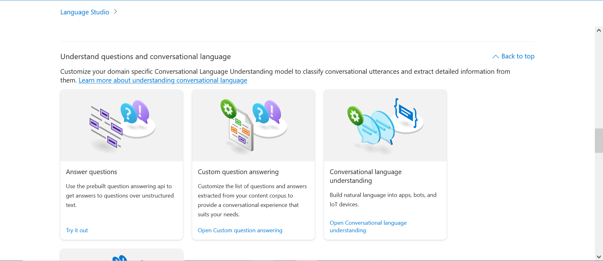

# Yammer Intergration with knowledge base

- [Yammer Intergration with knowledge base](#yammer-intergration-with-knowledge-base)
  - [Creating the knowledge base](#creating-the-knowledge-base)
  - [Test the endpoint on postman](#test-the-endpoint-on-postman)
  - [Using Power Automate to make a connection](#using-power-automate-to-make-a-connection)

This documentation will show how to connect a knowledge base with question and answer pairs with yammer. After the connection is made the result should be when a question is asked in a yammer community page a answer matching the question from the knowledge base should be retrived and shown as a reply to the orginal question. 

## Creating the knowledge base
Firstly the knowledge base (**KB**) needs to be created. Log into azure portal and create a language resource which has the functionally to create a KB. Furthermore the Cognitive Services Contributor role needs to be assigned to your account on the subscription you are using. Addtionally make sure the region of the language resource should match the region of the resource group or it wont work correctly.

**Create language resource in Azure Cli**

```azurecli
az cognitiveservices account create --name <resource_name> --resource-group <resource_group> --kind TextAnalytics --sku F0 --location <region_name> --yes
```

After the language resource is created go to the overview section scroll down and you should see **language studio**, open it on a new tab.


In the language studio scroll down until you find **Custom Question Answering** and open it. Create a new project, populate the fields inside containing the project name and source name. After the project is created add a **Azure Search Resource** to it (create a new one if there isn't a existing one already). When this is done a empty KB will be created



You'll now have to add a source to the KB there are three types of sources: **URLs**, **Files** and **Chitchat**. For now select files as a source using a excel file containing template questions: [SampleFAQs.xlsx](SampleFAQs.xlsx)

Question and answer pairs should now populate the KB. Go to the deploy knowledge base section and click deploy. After the deployment is finshied click **get prediction URL** and you'll be given endpoint to make requests.

## Test the endpoint on postman
The endpoint should be functional and ready to use for the next step. For a better understanding of the request headers and body then test it using postman. 

To start click the **get prediction URL** and copy the sample request curl


Open postman go to file then import and paste the sample request into raw text. After this is done the endpoint, parameters, headers and body will be automatically added. 


For the request to be successful changes to the body need to be made:
- On the question attribute replace "YOUR QUESTION HERE" to one of the questions on the excel file
- On both of the confidenceScoreThreshold attribute replace "YOUR_SCORE_THRESHOLD_HERE" to 0.0
- On the logicalOperation attribute replace "YOUR_LOGICAL_OPERATION_HERE" to AND

Finally delete the last section on the body the metadata as it's not needed 
```
"metadata": [
                {
                    "key": "YOUR_ADDITIONAL_PROP_KEY_HERE",
                    "value": "YOUR_ADDITIONAL_PROP_VALUE_HERE"
                }
            ]
```

After a request is sent you should recieve a 200 OK status and a response like this:
```
{
    "answers": [
        {
            "questions": [
                "Is the QnA Maker Service free?"
            ],
            "answer": "Yes. The QnA Maker tool is currently free to use. However, we do meter usage per account. See the Subscription Keys section of the documentation for details.",
            "confidenceScore": 1.0,
            "id": 4,
            "source": "SampleFAQs.xlsx",
            "metadata": {},
            "dialog": {
                "isContextOnly": false,
                "prompts": []
            }
        },
        {
            "questions": [
                "How do I log in to the QnA Maker Portal?"
            ],
            "answer": "You can log in with your Microsoft account.",
            "confidenceScore": 0.34020000000000006,
            "id": 3,
            "source": "SampleFAQs.xlsx",
            "metadata": {},
            "dialog": {
                "isContextOnly": false,
                "prompts": []
            }
        },
        {
            "questions": [
                "Who is the target audience for the QnA Maker tool?"
            ],
            "answer": "QnA Maker is primarily meant to provide a FAQ data source that you can query from your bot/application. Although developers will find this useful, content owners will especially benefit from this tool. QnA Maker is a completely no-code way of managing the content that powers your bot/application.",
            "confidenceScore": 0.0987,
            "id": 2,
            "source": "SampleFAQs.xlsx",
            "metadata": {},
            "dialog": {
                "isContextOnly": false,
                "prompts": []
            }
        }
    ]
}
```

## Using Power Automate to make a connection

To make a connection between the knowledge base and yammer itself Power Automate is required.

Go to the power automate page and log in https://emea.flow.microsoft.com/en-us/ 

Click on create and make a blank automated cloud flow, in the search bar under **Choose your flow's trigger** type in yammer and select **When there is a new message in the group**


Sign in with your microsoft account when a connection with yammer is requested.

Add the group and network ID of your choosing to the trigger step

Add two more steps that initialize variables. The subscription key variable needs to be the same as the language resource's key in azure and the project name variable needs to be the same as the name of the project created in the language studio 


Next create a condition step, checking if the message is a question. On the first text box and dyanmic content box should pop up type in message type in the search, select in and click OK. The condition has to be **equals to** and type 'question' into the second text box 


In the yes section add in two actions **HTTP** and **yammer post message** 

For the HTTP action copy all contect from the postman section and paste into it including: URL, Headers, Queries, Body.

The end result should look similar to the image below 


For the final action in the post message you can whatever you want in there for example in the image below the user's first name is included retrieved from the get user details action earlier. To include the answer in the message input the expression ```outputs('HTTP')?['body']?['answers'][0]?['answer'] ``` 
into text box. Additionally open **show advanced options** and input the dynamic content Message ID into **Replied to ID** for the message to reply to the orginal question

 
Now the save the flow for it to be ready to use.

Go to your yammer community page and ask a question the result should look like this 


